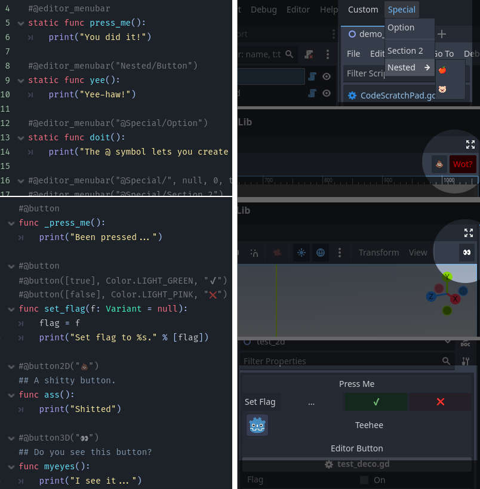

# Easy Editor Buttons
`v1.1`

Add buttons to the menu bar, inspector, or the 2D and 3D viewports in one line.



## 2D Viewport
```gd
#@button2D("💩")
func dump():
	print(JSON.print())
```

## 3D Viewport
```gd
#@button3D("👀")
func myeyes():
	print("I see it...")
```

## Menu Bar
> [!NOTE]
> These functions must be static.
> 
> When plugin is initialized, all scripts are scanned for @editor_menubar.
> 
> If you want to update the dropdown, disable and reenable the plugin.

```gd
# Must be a static function.
#@editor_menubar
static func method():
	print("Called.")

# Can pass a path.
#@editor_menubar("Reset/Score")
static func rscore():
	score = 0

# Paths beginning with an @ will create a new button.
#@editor_menubar("@Game/Create Item")
static func _create_item():
	var item := Item.new()
```

## Current Method Decorators
|id|Description|Arguments|Allows multiple|
|--|-----------|---------|---------------|
|`@button`| Adds button to object inspector.| `method args: Array` `button color: Color` `label override: String`|Yes|
|`@button2D`| Adds button to the 2D editor.| `label override: String` | |
|`@button3D`| Adds button to the 3D editor.| `label override: String` | |
|`@editor_menubar`|Adds button to dropdown in top menu bar.| `path: String` `icon_path: String` `rank: int` `seperator: bool` |Yes|

## Features
- Use multiple `#@button` decorators on the same method to create a row.
- Comments are shown in tooltip.

# Alternatively `_get_editor_buttons()`

```gd
func _get_editor_buttons():
	return [
		# Method name alone.
		"editor_button",
		# Reference to Callable.
		editor_button,
		# Callable with bound arguments.
		editor_button.bind(true),
		# Anonymous method.
		func(): print("Anon Unnamed Button."),
		# Anonymous method with name.
		func named(): print("Anon Named Button."),
		# Dictionary
		{ call="editor_button" }
		# Dictionary for 2D viewport.
		{ call="editor_button", type="2D", tint=Color.DEEP_SKY_BLUE }
		# Dictionary for 3D viewport.
		{ call="editor_button", type="3D", tooltip="This button does things." }
	]
```

> [!WARNING]
> When using a Resource, `_get_editor_buttons()` has to be static and use method names, not callables.

## Dict keys

|key|desc|values|default|
|---|----|------|-------|
|call|Method name or callable|||
|text|Optional label||Method name|
|type|Where to place button. Leave blank for inspector.|`2D` `3D`||
|tint|Color to tint button.||Color.WHITE|
|tooltip|Text to display on hover.|||

# Adding Your Own Decorators

They are quite easy to implement:

- Extend the `Decorator` class.
- Make sure `@tool` is on top.
- `class_name` is whatever you want decorator to be + `_decorator`
- Optionally an `_init()` can take optional arguments.

```gd
@tool
extends Decorator
class_name cheat_decorator

var override: String
var args: Array

func _init(override: String = "", args := []):
	self.override = override
	self.args = args

func get_cheat_name() -> String:
	if override:
		return override
	else:
		return method.replace("_", " ")

func execute_cheat():
	get_method().callv(args)
```

Then you add them in your class...

```gd
extends Node

#@cheat
func reset_score():
	score = 0

#@cheat("big money", ["money", 100])
#@cheat("swordy", ["sword"])
#@cheat("kingly", ["kings crown"])
#@cheat("free food", ["apple", 3])
func add_item(item: String, quantity := 1):
	items.append({item=item, quantity=quantity})

#@cheat
#@cheat("kill", [-100])
#@cheat("damage", [-10])
func heal(amount := 100):
	health += amount
```

And then retrieve them...

```gd
var cheats := {}

func add_cheats(object: Object):
	for deco in Decorator.get_methods(object):
		if deco is cheat_decorator:
			cheats[deco.get_cheat_name()] = deco

func do_cheat(id: String):
	if id in cheats:
		cheats[id].execute_cheat()
```

# Changes
## 1.1
- Added `@editor_menubar`
